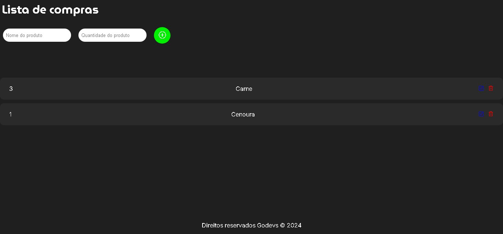

Lista de Compras

Descrição
Este é um projeto de uma aplicação simples de lista de compras que permite aos usuários adicionar, editar e excluir itens de uma lista. A aplicação armazena a lista de compras no localStorage, garantindo que os dados sejam mantidos mesmo após a atualização da página. O design é responsivo e inclui animações sutis para melhorar a experiência do usuário.

Funcionalidades
Adicionar Produtos: Insira o nome e a quantidade do produto na lista.
Editar Produtos: Atualize o nome ou a quantidade dos produtos existentes.
Excluir Produtos: Remova produtos indesejados da lista.
Persistência de Dados: Os produtos adicionados são armazenados no localStorage.
Interação Intuitiva: A interface é amigável e fácil de usar, com animações para interação.
Tecnologias Utilizadas
HTML
CSS
JavaScript
Como Usar
Clone o Repositório

bash
Copiar código
git clone https://github.com/seu_usuario/nome-do-repositorio.git
Navegue até o Diretório do Projeto

bash
Copiar código
cd nome-do-repositorio
Abra o arquivo index.html em seu navegador

bash
Copiar código
open index.html
Demonstração
Para uma demonstração ao vivo, acesse link para o projeto ao vivo (substitua pelo link real).

Contribuição
Sinta-se à vontade para contribuir! Se você encontrar algum problema ou tiver uma sugestão, abra uma issue ou envie um pull request.

Licença
Este projeto está licenciado sob a MIT License - veja o arquivo LICENSE para mais detalhes.

Contato
Nome: Seu Nome
Email: seu.email@example.com
LinkedIn: Seu LinkedIn
